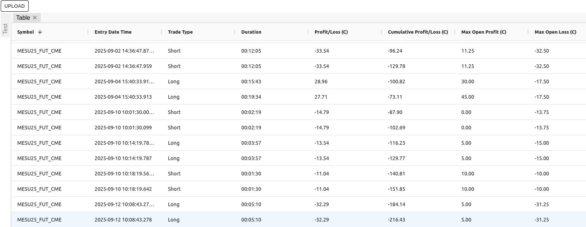

# logging application for sierra chart

## Getting started

### `npm install`
Install NPM dependencies  

### `cd gin-server && go run server.go`  
Run backend server.

### `npm start`
Run frontend/client.  
Open [http://localhost:3000](http://localhost:3000) to view it in the browser.

## Screenshots  

Displaying user log  
