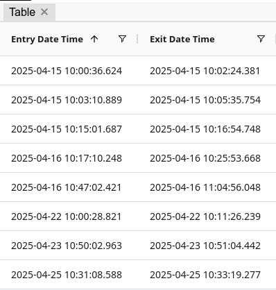
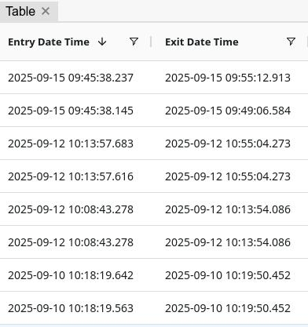

# logging application for sierra chart

## Getting started

### `npm install`
Install NPM dependencies  

### `cd gin-server && go run server.go`  
Run backend server.

### `npm start`
Run frontend/client.  
Open [http://localhost:3000](http://localhost:3000) to view it in the browser.

## Screenshots (feature branch implementations)  

Example of column filter (DateTime filter)  
  
   
   
Entry DateTime sorted as ascending    
  
   
   
Entry DateTime sorted as descending  
  