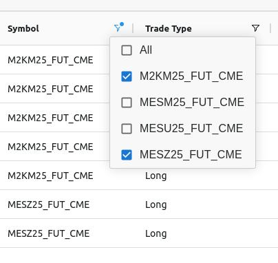

# logging application for sierra chart

## Getting started

### `npm install`
Install NPM dependencies  

### `cd gin-server && go run server.go`  
Run backend server.

### `npm start`
Run frontend/client.  
Open [http://localhost:3000](http://localhost:3000) to view it in the browser.

## Screenshots (feature branch implementations)  

All unchecked  
  
   
   
All checked  
   
   
   
One set checked  
  
   
   
Two sets checked  
  
   
   
Two columns utilizing filter set (Symbol: checked 2 sets, Type: Short)  
  